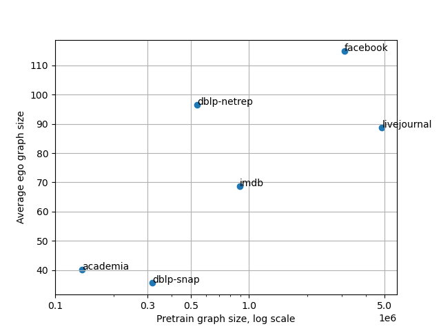
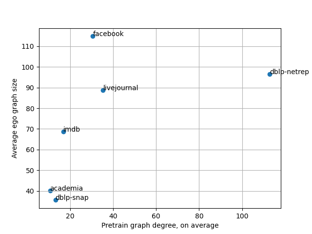

# Anonymous-Upload
Here, we upload images for Neurips 2022 submission of Spectral Graph Contrastive learning for reviewer ttS5 and D78f.

Edit, Aug 8 : We also add alignment literature for better illustration for reviewer hB1i.

# ttS5 - Example of how time complexity of spectral methods scales with datasets

We recall that these are the statistics of datasets available to pre train our networks : 

As such we observe that the size of the ego graph generally scales with the size of the overall graph, but somewhat slower than linearly, even on a log scale. Further the degree scaling is inconsistent, possibly due to the NetRep dataset.

Similar to the ego graph case, the time per graph is also widely varying with degree. However, if NetRep can be excluded, an overall trend of the time increasing with higher degree is obvious, as is the trend of increasing time with overall pretrain graph size.

However, quite importantly, the scaling is at best linear vs the log of the size of the graph, and hence manageable, and the ego graph does not come close to approaching 256 in average size. In short, the scaling is not untenable with the growth, and neither is SGCL particularly costly - it is close to GraphCL and all methods except MVGRL (computed with the heat variant).

# D78f - Example of negative transfer on IMDB-BINARY

We can see here some example histograms, with mean and standard deviation noted, and an overall Gaussian spread of outcomes for GCC[1] frozen transfers on IMDB-BINARY with DBLP as the pretrain bench. Contrary to what is desired, the performance is worse as the number of epochs increases. It becomes worse from 5 to 10 to 20.

This is an example of negative transfer (a form of overfitting) and is noted in section 4.3 of GCC as due to domain shift. It is in fact commonplace in Graph pre-training [2], and the primary reason frozen pre-training is beaten out by unsupervised methods. This phenomenon is not specific to GCC.

Below, all three figures are histograms of different random runs initialized from the same core model, with y-axis representing counts of the occurrence, and x-axis representing accuracy. The x-label indicates mean accuracy and standard deviation, and the mean accuracy falls with more training.

[1] Qiu, Jiezhong, et al. "GCC: Graph contrastive coding for graph neural network pre-training." KDD 2020.

[2] Hu, Weihua, et al. "Strategies for pre-training graph neural networks."  ICLR 2020.

# hB1i - Alignment

Here, we provide two illustrative figures we make that respectively demonstrate:
1.	The case where the global graph, after a random walk, can yield two views, which after Laplacian eigendecomposition end up with inconsistent embeddings for the same node, and thus requires alignment.
2.	The Wasserstein-Procrustes alignment process which is used as a subprocess to correct the inconsistent embeddings.
If the reader hope to know more details about the network embedding alignment, representative papers that explain the Wasserstein Procrustes method include CONE-ALIGN [2]- especially in figures 1 and 2 and section 4.2, as well as REGAL [3] and G-CREWE [4]. 

[1] Hu, Weihua, et al. "Strategies for pre-training graph neural networks."  ICLR 2020.
[2] Chen, Xiyuan, et al. "Cone-align: Consistent network alignment with proximity-preserving node embedding." CIKM 2020. https://dl.acm.org/doi/pdf/10.1145/3340531.3412136
[3] Heimann, Mark, et al. "Regal: Representation learning-based graph alignment." CIKM 2018. https://dl.acm.org/doi/pdf/10.1145/3269206.3271788
[4] Qin, Kyle K., et al. "G-crewe: Graph compression with embedding for network alignment." CIKM 2020. https://arxiv.org/pdf/2007.16208.pdf

